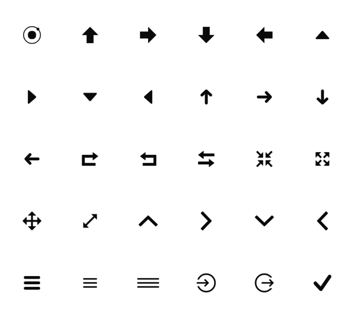
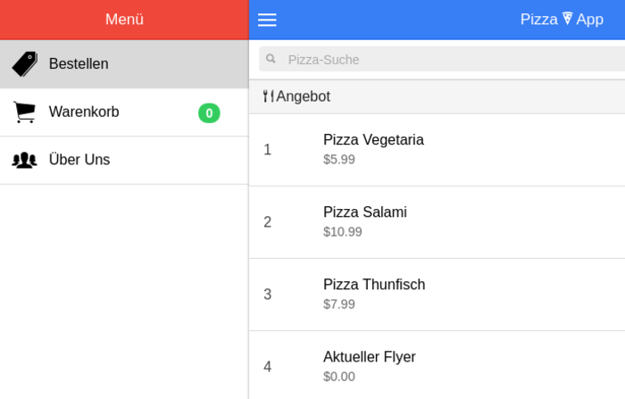

Für eine stylische App dürfen auch passende Icons nicht fehlen. Bei Ionic hat der Entwickler das Glück, dass das Ionic-Team eine eigene Icon-Font unter dem Namen **Ionicons** pflegt und stetig weiterentwickelt. Sie orientiert sich dabei an den System-Icons von iOS und Android. Dadurch stehen für verschiedene Anwendungsfälle gleich mehrere Icons zur Verfügung.


Die in unserem [Einführungsartikel](/artikel/ionic-tutorial-deutsch/ "Ionic Framework Tutorial") entwickelte Pizza-Service-App nutzt die Icon-Font, um sie ein wenig "aufzupeppen" (wenn das überhaupt noch irgendwie geht ;) ).

Link zum [Quellcode](https://github.com/angularjs-de/ionic-pizza-service/tree/master) und [Live-Demo](https://angularjs-de.github.io/ionic-pizza-service/#/order)

In einem Ionic-Projekt stehen die Icons direkt zur Verfügung. Natürlich können diese auch in jedem anderen Projekt genutzt werden. Dazu können die Schriftarten und die CSS-Datei von [code.ionicframework.com](http://code.ionicframework.com/ionicons/2.0.1/css/ionicons.min.css "CDN der Ionicons") heruntergeladen werden oder ihr bezieht die neuste Version einfach über das entsprechende [Git-Repository](https://github.com/driftyco/ionicons "Ionicons auf GitHub") bzw. den dort üblichen Wegen wie *bower* `bower install ionicons`  oder *component* `component install driftyco/ionicons`.

In die eigene App oder Webseite eingebunden, braucht ihr nur per entsprechende CSS-Klasse das Icon auswählen.

```html
<i class="icon ion-home"></i>
```

Dazu einfach die Klasse `icon`, gefolgt von der entsprechende Icon-Klasse, setzten.



Eine Liste aller Icons mit der dazugehörigen CSS-Klasse könnt ihr auf [ionicons.com](http://ionicons.com/ "Webseite Ionicons") einsehen und durchsuchen!

In der finalen Version unserer Ionic-Pizza-App werden an den unterschiedlichsten Stelle Ionicons zur Gestaltung genutzt.


