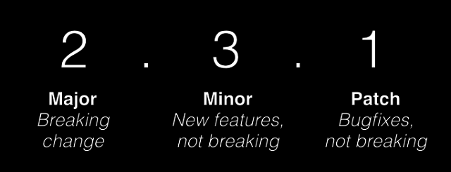
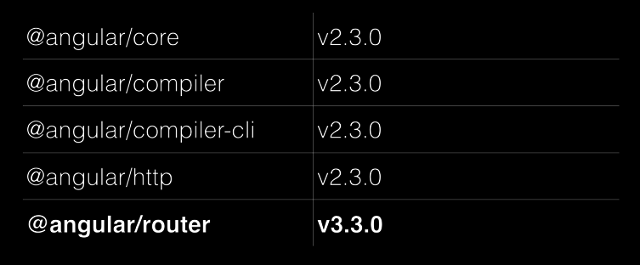
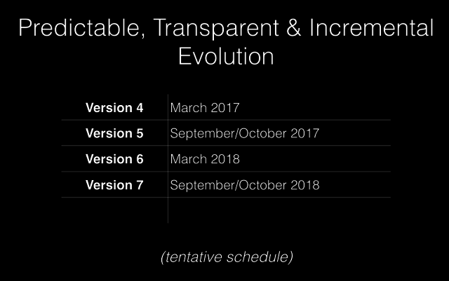

Kurzer Schock? Vielleicht! Woher kommt der Versionssprung? Keine Angst, ich erkläre euch worum es geht. Am 8. Dezember 2016 hat Igor Minar in seiner Keynote der NG-BE Conference den Release-Plan für das Angular Projekt angekündigt. Das Angular-Projekt setzt auf das System der semantischen Versionierung(SEMVER). Hierbei geht es darum, den Versionsnummer eine wirkliche Bedeutung zu geben. Dies soll Entwickler dabei unterstützen, besser mit Updates umzugehen.

## Was ist SEMVER?

SEMVER besteht hierbei aus 3 Teilen: **Major** Version, **Minor** Version, **Patch** Version. Die Idee ist nun ganz simple: Dein Projekt ist auf Version 2.3.1. Nun kommt ein neues Release 2.3.2 - es hat sich also die Patch-Version erhöht. Das heißt, dass wir dieses Update ohne weiteres einspielen können, da es sich um Bugfixes in unserer aktuellen Version handelt. Wir könnten dieses Update sogar automatisch via NPM durchführen lassen.

Wenn nun neue Features dazu kommen, garantiert uns die Erhöhung der Minor-Version ebenfalls, dass unsere Anwendungen auf Angular in Version 2 nicht brechen werden. Hier können wir entscheiden, ob wir dieses Update einspielen wollen oder nicht - je nachdem, ob wir die neues Features nutzen wollen. Patch und Minor Updates können und sollen also ohne das Eingreifen in euern Quellcode möglich sein. Wichtig für uns ist hierbei immer nur der Sprung der Major-Version. Dieser zeigt an, dass wir als Entwickler beim Update auf eine höhere Version unseren geschriebenen Quellcode anpassen müssen. Dies kann z.B. durch die Umbenennung einer Core-Direktive oder auch einer Service-API kommen. Was vollkommen okay ist - Software die am Puls der Zeit bleiben will muss irgendwann Breaking-Changes in Kauf nehmen, sonst bleiben wir in der Vergangenheit hängen. Ein Beispiel hierfür ist der Wechsel von TypeScript Version 1.8 auf Version 2.2, da hierbei einige Features von TypeScript nicht mehr verfügbar sind, ist dies ein Breaking-Change - auch wenn es nur eine Abhängigkeit von Angular selbst ist.

## Warum Angular 4?
Alle Angular Pakete befinden sich in einem Git-Repository. Alle Core-Pakete sind in der Major Version 2, nur der Router ist in Version 3. Um dies zu beheben wird der nächste Breaking Change alle Versionen auf Major Version 4 ziehen, damit werden alle Pakete innerhalb von Angular ab diesem Zeitpunkt einheitlich nach SEMVER behandelt.

Dies wird wahrscheinlich im März passieren. Den Release plan hierfür gibt es auch schon. Es sind bereits Die Major Versions-Sprünge bis Version 7 im September 2018 geplant. Es ist jetzt also einfach nur noch Angular in einer spezifischen Version. Die Sprünge von 2 nach 4 und 5 werden viel kleiner und einfachen als der Sprung von 1 nach 2. Es bleibt ja die gleiche Code-Basis.

## Zusammenfassend

Lasst euch einfach nicht zu sehr von den Versionsnummer schocken und nutzt die klare Versions-Struktur, die euch direkt wissen lässt, ob ihr manuellen Aufwand bei einem Update einplanen müsst oder nicht. Ich finde die Entscheidung sehr gut und freue mich die Projekte mit der neuen Versionierung zu betreiben, da die Planung von Updates viel einfacher und klarer wird!
